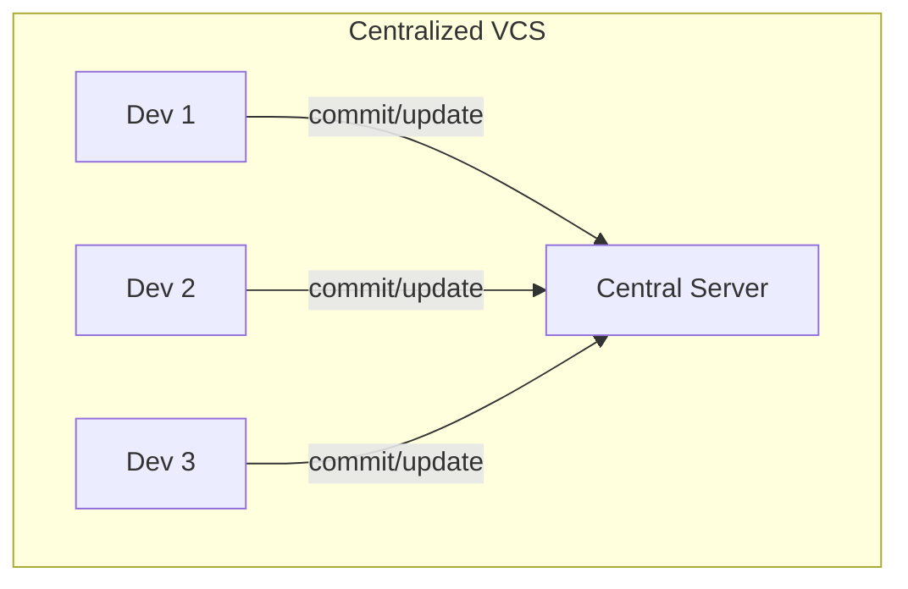
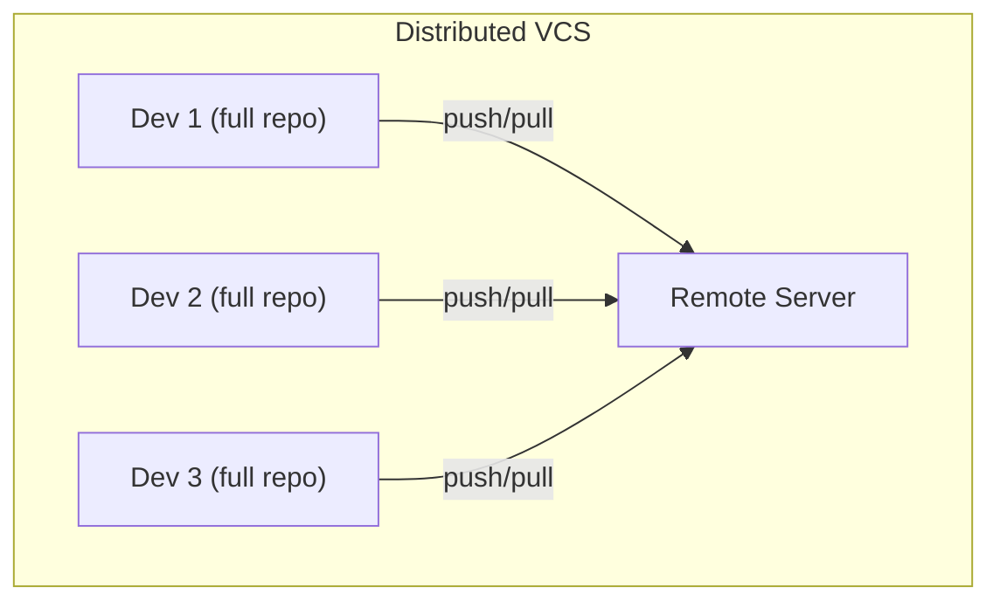
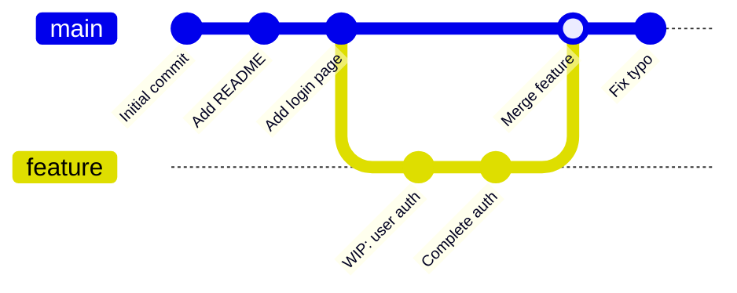

# Chapter 1: Introduction to Git

Git is a **[distributed version control system](./glossary.md#distributed-vcs)** (DVCS) created by Linus Torvalds in 2005 to manage Linux kernel development. It tracks changes to files over time, letting you recall any previous version, collaborate safely, and experiment without risk.

## What Problem Does Git Solve?

Without version control, teams resort to:

- `final.zip`, `final_v2.zip`, `final_ACTUALLY_FINAL.zip`
- Emailing files back and forth
- Overwriting each other's work

Git solves this with a complete, permanent history of every change ever made, stored in a **[repository](./glossary.md#repository-repo)**.

## Centralized vs. Distributed VCS

In a **centralized** system (like SVN), there is one server. Everyone commits to it. If the server goes down, no one can work.

In a **distributed** system like Git, every developer has a full copy of the entire history. There is no single point of failure.

## How Git Stores Data

Most systems track file-based deltas — what changed between versions. Git instead stores **snapshots**. Each **[commit](./glossary.md#commit)** is a complete picture of your project at that moment. Unchanged files are referenced from the previous snapshot rather than duplicated.

## The Three Guarantees

1. **Integrity** — Everything is checksummed with a [SHA-1](./glossary.md#sha-1) hash before storage. It is impossible to change any file without Git knowing.
2. **Non-destructive** — Nearly all Git operations only add data. It is very hard to permanently lose committed work.
3. **Speed** — Almost all operations are local. No network latency for history, diffs, or logs.

---

→ **Next:** [Chapter 2: Installing Git](./02-installing-git.md)
