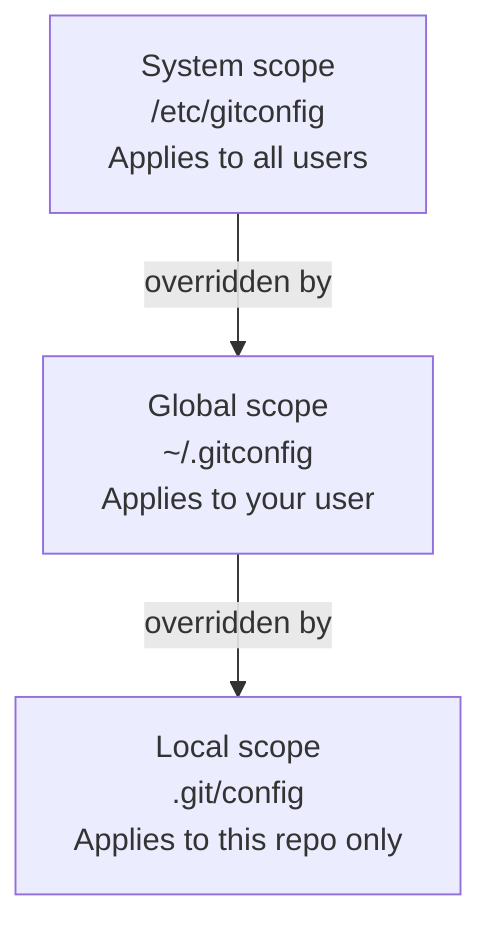

# Chapter 2: Installing Git

Git runs on macOS, Windows, and Linux. After installing, you configure your identity — Git embeds this information into every commit you make.

## macOS

```bash
# Option 1: Homebrew (recommended)
brew install git

# Option 2: Xcode Command Line Tools
xcode-select --install
```

## Windows

Download the installer from **git-scm.com**. During setup, select:

- **Git Bash** as the terminal emulator — it provides a Unix-like shell on Windows
- **"Use Git from the command line and also from 3rd-party software"** for PATH integration
- **OpenSSH** as the SSH executable

## Linux

```bash
# Debian / Ubuntu
sudo apt install git

# Fedora / RHEL
sudo dnf install git

# Arch
sudo pacman -S git
```

## Verifying Installation

```bash
git --version
# git version 2.43.0
```

## Initial Configuration

Git has three configuration scopes. Each level overrides the one above it.



Set your identity at the global scope so it applies to all repositories:

```bash
git config --global user.name "Your Name"
git config --global user.email "you@example.com"

# Set VS Code as the default editor
git config --global core.editor "code --wait"

# Set 'main' as the default branch name for new repos
git config --global init.defaultBranch main

# Review all settings
git config --list
```

> **Tip:** Use `--local` inside a work repository to override your personal email with a work address, without touching your global config.

---

→ **Next:** [Chapter 3: Basic Git Commands](./03-basic-git-commands.md)
← **Prev:** [Chapter 1: Introduction](./01-introduction.md)
