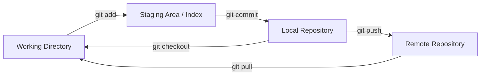

# Chapter 3: Basic Git Commands

Every Git workflow revolves around a small set of core commands. This chapter covers the daily operations you will use constantly.

## The Three States

Every file in a Git repository lives in one of three states. Understanding this model is the foundation of everything else.

- **[Working directory](./glossary.md#working-directory)** — Your local files as you see them on disk.
- **[Staging area](./glossary.md#staging-area)** (also called the **[index](./glossary.md#index)**) — A preparation zone where you assemble the exact changes you want in your next commit.
- **Repository** — The permanent, committed history stored in `.git/`.



## Initializing a Repository

```bash
# Start tracking an existing project folder
cd my-project
git init
# Initialized empty Git repository in .git/
```

This creates a hidden `.git/` directory. That folder IS the repository — it contains all history, config, and objects.

## Checking Status

```bash
git status
```

`git status` is your most-used command. Run it constantly. It shows which files are untracked, modified, or staged.

## Staging Changes

```bash
# Stage a specific file
git add README.md

# Stage all changes in the current directory
git add .

# Stage parts of a file interactively (hunk by hunk)
git add -p README.md
```

> **Key concept:** You do not have to stage an entire file. `git add -p` lets you choose exactly which lines to include in the next commit. This keeps commits focused and logical.

## Committing

```bash
git commit -m "Add user authentication module"

# Open the configured editor for a longer message
git commit
```

A good commit message uses the **imperative mood**: "Add feature" not "Added feature". The first line should be under 72 characters.

## Viewing History

```bash
# Full log
git log

# Compact, one line per commit
git log --oneline

# Show a graph of branches
git log --oneline --graph --all

# Show changes introduced by each commit
git log -p
```

## Viewing Differences

```bash
# Changes in the working directory (not yet staged)
git diff

# Changes that are staged (what will be committed)
git diff --staged

# Difference between two commits
git diff abc1234 def5678
```

## The .gitignore File

Tell Git to never track certain files by creating a `.gitignore` file in the repo root.

```
# Dependencies
node_modules/

# Build output
dist/
*.min.js

# Environment files — never commit secrets
.env
.env.local

# OS clutter
.DS_Store
Thumbs.db
```

Patterns use glob syntax. A `/` prefix anchors to the repo root. A trailing `/` matches only directories.

## Complete First-Commit Walkthrough

```bash
mkdir my-project && cd my-project
git init

echo "# My Project" > README.md
git status
# Untracked files: README.md

git add README.md
git status
# Changes to be committed: new file: README.md

git commit -m "Initial commit: add README"
# [main (root-commit) a1b2c3d] Initial commit: add README
```

---

→ **Next:** [Chapter 4: Working with Branches](./04-working-with-branches.md)
← **Prev:** [Chapter 2: Installing Git](./02-installing-git.md)
