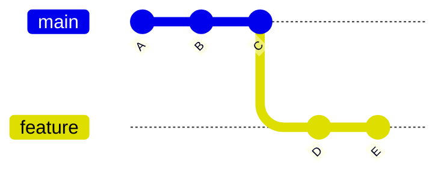
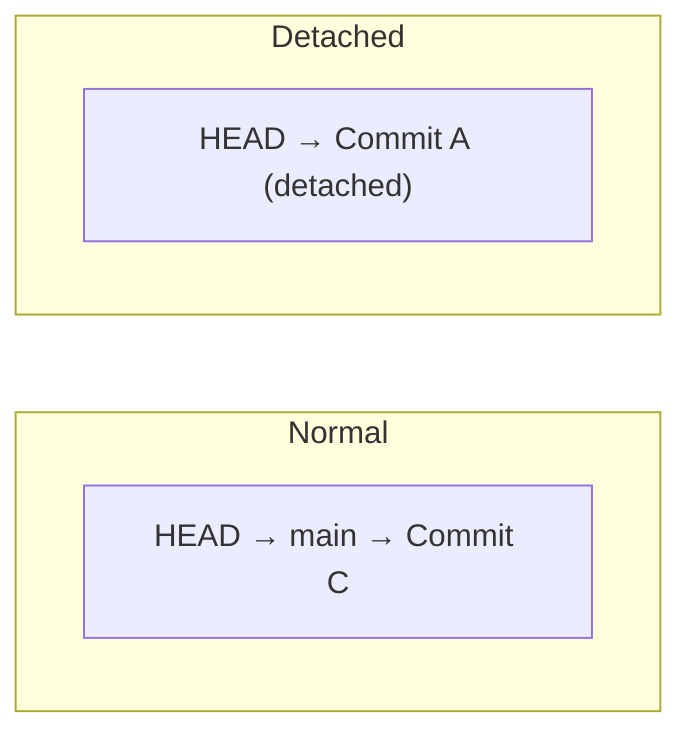

# Chapter 4: Working with Branches

A **[branch](./glossary.md#branch)** is a lightweight, movable pointer to a commit. Creating one takes milliseconds and costs almost no disk space. Branches are how you isolate work — features, fixes, and experiments all get their own branch.

## What is HEAD?

**[HEAD](./glossary.md#head)** is a special pointer that tells Git which branch (or commit) you are currently on. When you make a commit, HEAD and the branch it points to both advance to the new commit.



In this diagram, `main` points to C and `feature` points to E. HEAD points to whichever branch you have checked out.

## Core Branch Commands

```bash
# List all local branches (* marks current)
git branch

# List all branches including remotes
git branch -a

# Create a new branch
git branch feature/user-auth

# Switch to a branch (modern syntax)
git switch feature/user-auth

# Create AND switch in one step
git switch -c feature/user-auth

# Rename a branch
git branch -m old-name new-name

# Delete a merged branch (safe)
git branch -d feature/user-auth

# Force-delete regardless of merge status
git branch -D feature/user-auth
```

## Branch Naming Conventions

Consistent naming makes large repositories navigable. Common conventions:

| Prefix | Purpose | Example |
|--------|---------|---------|
| `feature/` | New functionality | `feature/user-auth` |
| `fix/` | Bug fixes | `fix/login-redirect` |
| `chore/` | Maintenance, deps | `chore/update-eslint` |
| `release/` | Release preparation | `release/v2.1.0` |
| `hotfix/` | Urgent production fix | `hotfix/payment-crash` |

## Detached HEAD State

**[Detached HEAD](./glossary.md#detached-head)** occurs when HEAD points directly to a commit hash rather than to a branch name. This happens when you checkout a specific commit, tag, or remote branch reference.

```bash
git checkout abc1234
# You are in 'detached HEAD' state
```



Any commits made in detached HEAD state are not on any branch. If you switch away, those commits become unreachable and will eventually be garbage collected.

**Recovery:** If you want to keep work done in detached HEAD, create a branch immediately:

```bash
git switch -c my-rescue-branch
```

---

→ **Next:** [Chapter 5: Introduction to GitHub](./05-introduction-to-github.md)
← **Prev:** [Chapter 3: Basic Git Commands](./03-basic-git-commands.md)
