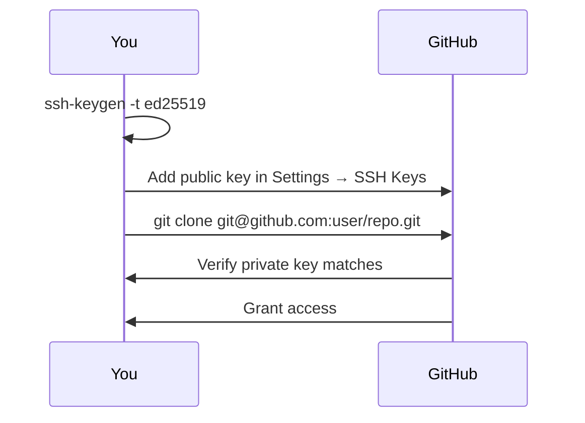

# Chapter 5: Introduction to GitHub

GitHub is a cloud-based hosting platform for Git repositories. Git is the tool; GitHub is the service built around it. It adds collaboration features: pull requests, issues, Actions, Pages, and team management.

## Key Concepts

- **[Remote](./glossary.md#remote)** — A version of your repository hosted on a server. The primary remote is conventionally named `origin`.
- **[Fork](./glossary.md#fork)** — Your personal copy of someone else's repository on GitHub. You can make changes freely without affecting the original.
- **[Clone](./glossary.md#clone)** — Downloading a full copy of a remote repository to your local machine, including all history.

## Creating a Repository on GitHub

1. Click **New repository** on github.com
2. Choose a name, visibility (public/private), and optional README
3. Connect your local project:

```bash
# Link an existing local repo to the new remote
git remote add origin git@github.com:username/repo.git
git push -u origin main
```

## Authentication: SSH vs HTTPS

SSH keys are the recommended authentication method. You generate a key pair, add the public key to GitHub, and Git uses the private key automatically.



### Generating an SSH Key

```bash
# Generate a modern ed25519 key
ssh-keygen -t ed25519 -C "you@example.com"

# Copy the public key — paste this into GitHub
cat ~/.ssh/id_ed25519.pub

# Test the connection
ssh -T git@github.com
# Hi username! You've successfully authenticated.
```

### HTTPS with a Personal Access Token

If you cannot use SSH, use a **Personal Access Token (PAT)** in place of your password. Generate one at GitHub → Settings → Developer settings → Personal access tokens.

```bash
git clone https://github.com/username/repo.git
# Username: your GitHub username
# Password: your PAT (not your account password)
```

## GitHub vs. Git

| | Git | GitHub |
|---|---|---|
| Type | Local tool | Cloud service |
| Runs | On your machine | On GitHub's servers |
| Required | Yes | No (but standard) |
| Features | Version control | PRs, Issues, Actions, Pages |

---

→ **Next:** [Chapter 6: Working with Remote Repositories](./06-remote-repositories.md)
← **Prev:** [Chapter 4: Working with Branches](./04-working-with-branches.md)
