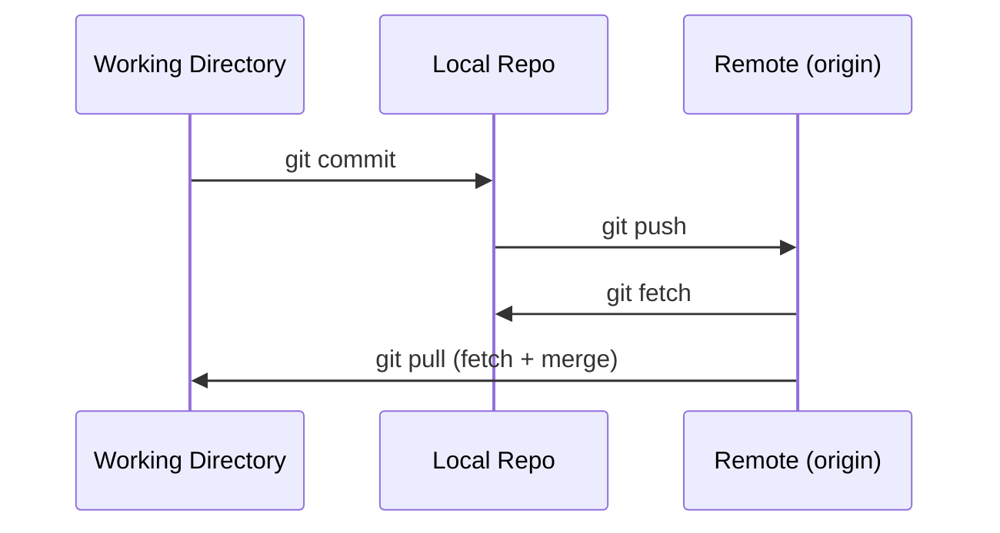

# Chapter 6: Working with Remote Repositories

A **[remote](./glossary.md#remote)** is a version of your repository hosted on a server. Remotes let you back up your work, share it with teammates, and sync across machines.

## Core Remote Commands

```bash
# List configured remotes with URLs
git remote -v

# Add a remote named 'origin'
git remote add origin git@github.com:user/repo.git

# Remove a remote
git remote remove origin

# Rename a remote
git remote rename origin upstream
```

## Push, Pull, and Fetch

These three operations move data between your local repository and a remote.



### git push

Uploads your local commits to the remote.

```bash
# Push and set the upstream tracking branch (do this once per branch)
git push -u origin main

# Subsequent pushes on a tracked branch
git push

# Push all local tags
git push --tags
```

### git fetch

**[Fetch](./glossary.md#fetch)** downloads remote changes into your local repository but does **not** touch your working directory or current branch. It updates your remote-tracking references (`origin/main`, etc.).

```bash
git fetch origin

# Fetch and remove remote-tracking refs for deleted remote branches
git fetch --prune
```

Use `git log origin/main` after fetching to inspect what changed before deciding to merge.

### git pull

**[Pull](./glossary.md#pull)** is shorthand for `git fetch` followed by `git merge`. It downloads and immediately integrates remote changes.

```bash
git pull

# Prefer rebase over merge when pulling (cleaner history)
git pull --rebase
```

> **Recommendation:** Many teams set `pull.rebase = true` in their global config so that `git pull` always rebases rather than creating unnecessary merge commits.

## Upstream Tracking

When a local branch tracks a remote branch, Git knows where to push and pull without you specifying.

```bash
# Check tracking relationships
git branch -vv
# main  abc1234 [origin/main] Add README
```

## Cloning a Repository

```bash
# Clone via SSH
git clone git@github.com:user/repo.git

# Clone into a specific folder name
git clone git@github.com:user/repo.git my-folder

# Clone only the latest snapshot (shallow clone, faster for large repos)
git clone --depth 1 git@github.com:user/repo.git
```

---

→ **Next:** [Chapter 7: Using a Git GUI](./07-git-gui.md)
← **Prev:** [Chapter 5: Introduction to GitHub](./05-introduction-to-github.md)
