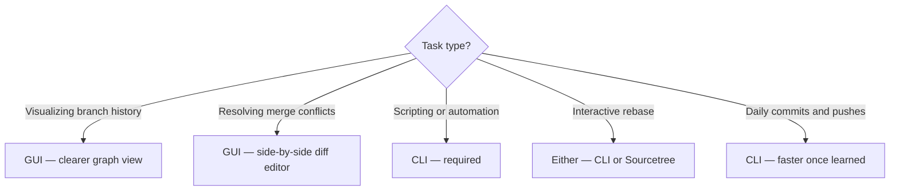

# Chapter 7: Using a Git GUI

The command line gives you full control over Git, but graphical tools make it easier to visualize history, review diffs, and manage complex branching situations. The two approaches complement each other well.

## Popular GUI Tools

### GitLens (VS Code Extension)

The most widely used Git integration for VS Code. Adds inline blame annotations, a rich history explorer, branch management, and a visual diff editor — all without leaving your editor.

**Best for:** Developers already working in VS Code who want Git context without context-switching.

### GitHub Desktop

GitHub's official, cross-platform GUI. Simple interface focused on the most common operations: clone, commit, push, pull, and open pull requests.

**Best for:** Beginners, or anyone who wants a clean visual overview alongside the terminal.

### Sourcetree (Free, Atlassian)

A powerful desktop application with a detailed branch graph and first-class support for Git Flow. Strong support for interactive rebase and cherry-picking via drag-and-drop.

**Best for:** Developers managing complex branching workflows who want a dedicated Git application.

### lazygit

A terminal-based UI (TUI) for Git, operated entirely with keyboard shortcuts. Extremely fast. Shows status, diff, log, and branch views in a split-pane terminal interface.

**Best for:** Terminal-native developers who want speed without leaving the command line.

## When to Use a GUI vs. CLI

> **Recommendation:** Learn the CLI first so you understand what every operation actually does. Then use a GUI where it genuinely speeds you up — history visualization and conflict resolution are the two best use cases.

---

→ **Next:** [Chapter 8: More on Branches](./08-more-on-branches.md)
← **Prev:** [Chapter 6: Working with Remote Repositories](./06-remote-repositories.md)
