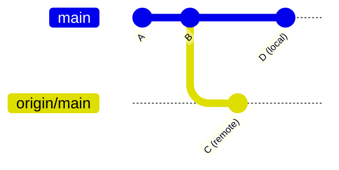
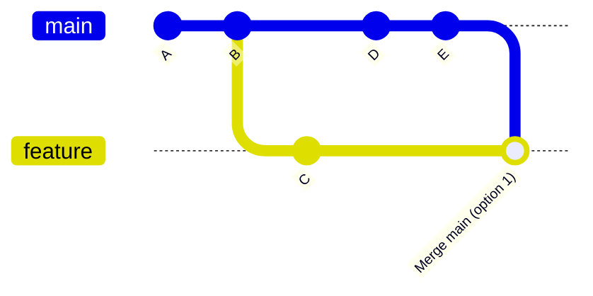

# Chapter 8: More on Branches

With the basics covered, this chapter goes deeper into how branches behave: remote-tracking branches, branch strategies, and keeping long-lived branches in sync.

## Remote-Tracking Branches

When you fetch or clone, Git creates **remote-tracking branches** like `origin/main`. These are read-only snapshots of where the remote branches were the last time you fetched. They live in `.git/refs/remotes/`.

```bash
# See all remote-tracking branches
git branch -r
# origin/main
# origin/feature/new-api

# See local and remote together
git branch -a
```



In this diagram, your local `main` and `origin/main` have diverged. A `git pull` or `git fetch` + `git merge` would reconcile them.

## Tracking Branches

A **tracking branch** is a local branch configured to follow a remote branch. Git uses this relationship to show you how far ahead or behind you are.

```bash
git branch -vv
# main  d1e2f3a [origin/main: ahead 2, behind 1] Add button
```

- **ahead 2** — you have 2 local commits not yet pushed
- **behind 1** — origin has 1 commit you haven't pulled yet

## Checking Out Remote Branches

When a teammate pushes a branch, you can check it out locally:

```bash
git fetch origin
git switch feature/new-api
# Branch 'feature/new-api' set up to track 'origin/feature/new-api'
```

Git automatically creates a local tracking branch if the name matches a remote branch.

## Pruning Stale References

When remote branches are deleted (e.g., after a PR is merged), your remote-tracking refs become stale. Clean them up:

```bash
git fetch --prune

# Or configure this to happen automatically
git config --global fetch.prune true
```

## Keeping a Feature Branch Up to Date

When your feature branch runs for more than a day or two, `main` moves on. You need to incorporate those changes. Two approaches:



**Option 1 — Merge main into feature:** Preserves history, creates a merge commit. Safe but adds noise.

**Option 2 — Rebase feature onto main:** Replays your commits on top of the latest main. Linear history, but rewrites commit hashes. See [Chapter 11: Rebasing](./11-rebasing.md) for full details.

---

→ **Next:** [Chapter 9: Merging](./09-merging.md)
← **Prev:** [Chapter 7: Using a Git GUI](./07-git-gui.md)
