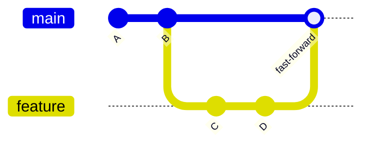
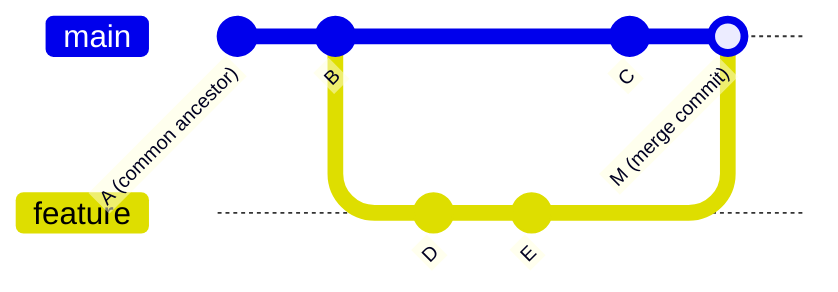

# Chapter 9: Merging

**[Merging](./glossary.md#merge)** integrates the changes from one branch into another. You always merge *into* the branch you have checked out.

```bash
git switch main
git merge feature/user-auth
```

## Fast-Forward Merge

A **[fast-forward merge](./glossary.md#fast-forward-merge)** happens when the target branch (e.g., `main`) has not diverged from the source branch. Git simply moves the branch pointer forward. No **[merge commit](./glossary.md#merge-commit)** is created.



Before the merge, `main` pointed to B and `feature` pointed to D. After, `main` simply advances to D.

## 3-Way Merge

When both branches have diverged — each has commits the other doesn't — Git performs a **3-way merge**. It uses three commits: the common ancestor, the tip of your branch, and the tip of the branch being merged.



The result is a **merge commit** (M) with two parent commits (C and E).

## Merge Options

```bash
# Standard merge (fast-forward if possible, else 3-way)
git merge feature/user-auth

# Force a merge commit even when fast-forward is possible
git merge --no-ff feature/user-auth

# Merge but only stage changes, do not commit (review first)
git merge --squash feature/user-auth
git commit -m "feat: user authentication"

# Abort a merge in progress
git merge --abort
```

### When to Use --no-ff

`--no-ff` preserves the fact that a feature branch existed. The branch topology remains visible in the history graph, even if Git could have fast-forwarded.


Many teams require `--no-ff` on `main` to make it clear exactly which commits belong to which feature.

## After the Merge

```bash
# Confirm the merge looks correct
git log --oneline --graph

# Delete the feature branch (it's been merged, no longer needed)
git branch -d feature/user-auth

# Delete the remote branch too
git push origin --delete feature/user-auth
```

---

→ **Next:** [Chapter 10: Conflicts](./10-conflicts.md)
← **Prev:** [Chapter 8: More on Branches](./08-more-on-branches.md)
