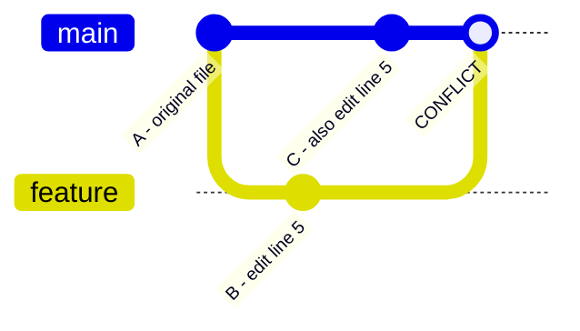

# Chapter 10: Conflicts

A **[conflict](./glossary.md#conflict)** occurs when two branches modify the same lines of the same file, or when one branch deletes a file that another branch modified. Git cannot decide which version is correct, so it pauses the merge and asks you to resolve it manually.

## When Conflicts Happen



Both B and C edited line 5. Git doesn't know which version to keep.

## What a Conflict Looks Like

Git inserts conflict markers directly into the file:

```
<<<<<<< HEAD
const greeting = "Hello, World!";
=======
const greeting = "Hi there, Universe!";
>>>>>>> feature/update-greeting
```

- Everything between `<<<<<<< HEAD` and `=======` is your current branch's version.
- Everything between `=======` and `>>>>>>>` is the incoming branch's version.

## Resolving a Conflict

1. **Open the conflicted file.** Look for the `<<<<<<<` markers.
2. **Edit the file** to the correct final state. Remove all conflict markers.
3. **Stage the resolved file:** `git add <filename>`
4. **Complete the merge:** `git commit`

```bash
# See which files have conflicts
git status
# both modified: src/greeting.js

# After manually editing src/greeting.js
git add src/greeting.js
git commit
# Git pre-fills the merge commit message
```

## Using a Merge Tool

Configure a visual 3-panel merge editor to make resolution easier:

```bash
# Use VS Code as the merge tool
git config --global merge.tool vscode
git config --global mergetool.vscode.cmd 'code --wait $MERGED'

# Launch the tool for all conflicted files
git mergetool
```

VS Code's merge editor shows: **Incoming**, **Current**, **Base (common ancestor)**, and **Result** — all in one view.

## Conflict Prevention

The best conflict is one that never happens:

- **Pull frequently** — the longer you go without syncing, the more divergence builds up.
- **Keep branches short-lived** — merge feature branches within a few days.
- **Communicate** — if two people need to touch the same file, coordinate who goes first.

## Aborting

If you want to abandon the merge entirely and return to the state before you ran `git merge`:

```bash
git merge --abort
```

---

→ **Next:** [Chapter 11: Rebasing](./11-rebasing.md)
← **Prev:** [Chapter 9: Merging](./09-merging.md)
