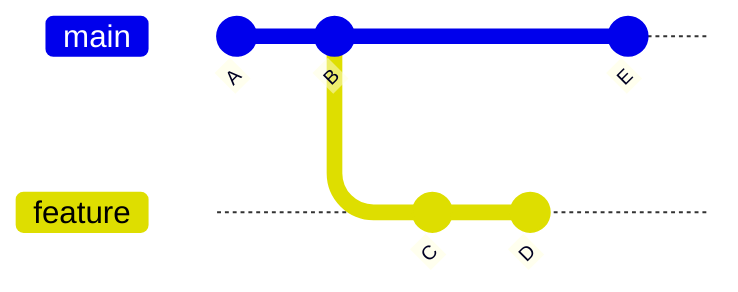
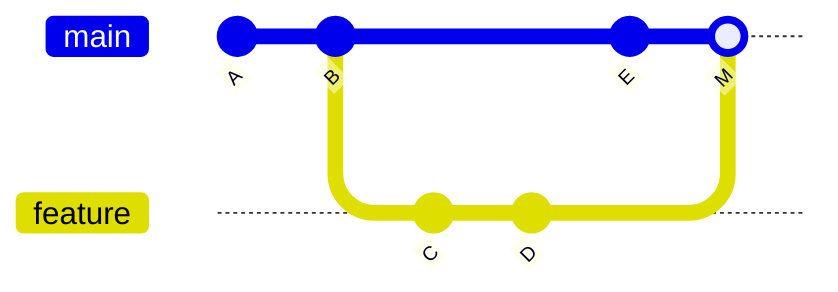

# Chapter 11: Rebasing

**[Rebase](./glossary.md#rebase)** moves a sequence of commits to a new base commit. The result is a linear history with no merge commits — as if the work had always been done on top of the current branch tip.

## Merge vs. Rebase

Both integrate changes from one branch into another. The difference is in the resulting history.



**After `git merge feature` on main:**



**After `git rebase main` on feature, then fast-forward merge:**


C and D are replayed as C' and D' — new commits with new [SHA-1](./glossary.md#sha-1) hashes but the same changes.

## Basic Rebase

```bash
# From the feature branch, rebase onto main
git switch feature/my-feature
git rebase main

# If all goes well, fast-forward merge on main
git switch main
git merge feature/my-feature
```

## Interactive Rebase

Interactive rebase lets you rewrite, reorder, squash, or drop commits before they are shared. It opens an editor listing recent commits.

```bash
# Edit the last 4 commits
git rebase -i HEAD~4
```

The editor shows:

```
pick a1b2c3d feat: add login form
pick d4e5f6g fix: typo in label
pick c7d8e9f feat: add validation
pick j0k1l2m wip: half done
```

Change `pick` to:

| Keyword | Action |
|---------|--------|
| `pick` | Keep the commit as-is |
| `reword` | Keep commit, edit its message |
| `edit` | Pause to amend the commit |
| `squash` | Combine into the previous commit |
| `fixup` | Like squash, but discard this commit's message |
| `drop` | Remove the commit entirely |

## Handling Conflicts During Rebase

Rebase applies commits one at a time. A conflict pauses the process.

```bash
# Fix the conflict in the file, then:
git add <resolved-file>
git rebase --continue

# To abandon the entire rebase and return to original state:
git rebase --abort
```

## The Golden Rule

> **Never rebase commits that have already been pushed to a shared branch.**

Rebase rewrites commit hashes. If teammates have already pulled those commits, their history will diverge from yours when they try to sync. Only rebase local, private branches.

---

→ **Next:** [Chapter 12: Squashing](./12-squashing.md)
← **Prev:** [Chapter 10: Conflicts](./10-conflicts.md)
