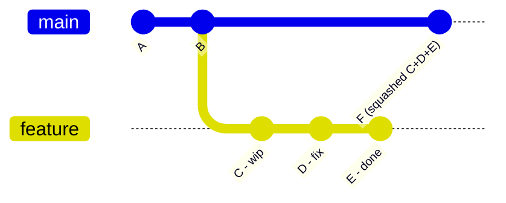

# Chapter 12: Squashing Commits

**[Squashing](./glossary.md#squash)** combines multiple commits into a single one. It is used to clean up a messy in-progress history before merging to a shared branch — replacing a series of "WIP", "fix typo", and "oops" commits with one clear, meaningful commit.

## Why Squash?

A feature branch often accumulates noise:

```
d4e5f6g  wip
c7d8e9f  fix lint
b0c1d2e  actually fix it this time
a3b4c5d  feat: add payment form
```

After squashing, the history becomes:

```
f1e2d3c  feat: add payment form
```

This keeps `main` history clean and reviewable.

## Squashing with Interactive Rebase

The most flexible way to squash is with `git rebase -i`. See [Chapter 11: Rebasing](./11-rebasing.md) for the full interactive rebase workflow.

```bash
git rebase -i HEAD~4
```

In the editor:

```
pick a3b4c5d feat: add payment form
squash b0c1d2e actually fix it this time
squash c7d8e9f fix lint
squash d4e5f6g wip
```

Git then opens a second editor to write the final combined commit message. Keep the meaningful lines and delete the noise.

## Squashing with git merge --squash

When merging a feature branch into main, `--squash` stages all the feature branch's changes as a single uncommitted diff. You then write one commit message.

```bash
git switch main
git merge --squash feature/payment-form
git commit -m "feat: add payment form"
```



Note: with `--squash`, the feature branch commits are not recorded as parents of F. The branch graph does not show a merge — the history is linear.

## When to Squash vs. When Not To

**Squash when:**
- Commits are WIP checkpoints with no informational value
- You want a clean, readable `main` history
- Your team requires one commit per PR

**Don't squash when:**
- Individual commits represent meaningful, separable changes
- The commit history serves as documentation of design decisions
- Debugging may require `git bisect` across those commits (see [Chapter 19](./19-reflog-bisect-cherry-pick.md))

---

→ **Next:** [Chapter 13: Stashing](./13-stashing.md)
← **Prev:** [Chapter 11: Rebasing](./11-rebasing.md)
