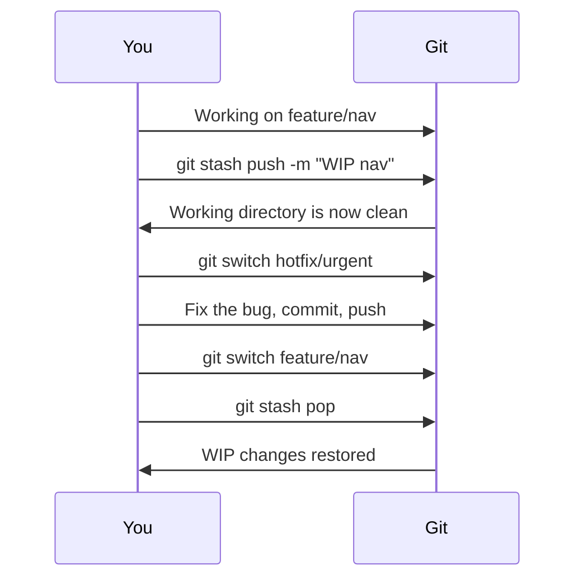

# Chapter 13: Stashing

**[Stashing](./glossary.md#stash)** temporarily shelves uncommitted changes so you can switch context — change branches, pull updates, or handle an urgent fix — without committing unfinished work.

## Basic Stash Operations

```bash
# Save current changes to the stash
git stash

# Save with a descriptive message
git stash push -m "WIP: redesigning nav component"

# List all stashes
git stash list
# stash@{0}: On feature/nav: WIP: redesigning nav component
# stash@{1}: WIP on main: quick experiment

# Apply the most recent stash (keeps it in the list)
git stash apply

# Apply and remove from the list
git stash pop

# Apply a specific stash
git stash apply stash@{1}

# Delete a specific stash
git stash drop stash@{0}

# Delete all stashes
git stash clear
```

## What Gets Stashed?

By default, `git stash` saves:
- Changes to tracked files (both staged and unstaged)

It does **not** save:
- Untracked files (new files not yet `git add`ed)
- Ignored files

```bash
# Include untracked files
git stash -u

# Include untracked AND ignored files
git stash -a
```

## Stash Workflow Example



## Creating a Branch from a Stash

If you stashed work and later realize it deserves its own branch:

```bash
git stash branch feature/stashed-idea stash@{0}
```

This creates a new branch, checks it out, and applies the stash — all in one step. The stash is dropped if the apply succeeds.

## Stash Internals

Stashes are stored as commits under `refs/stash`. They are not branches, but they use the same object model. This is why `git stash list` can show you the parent commit context.

---

→ **Next:** [Chapter 14: Reverting Commits and Tags](./14-reverting-commits-and-tags.md)
← **Prev:** [Chapter 12: Squashing](./12-squashing.md)
