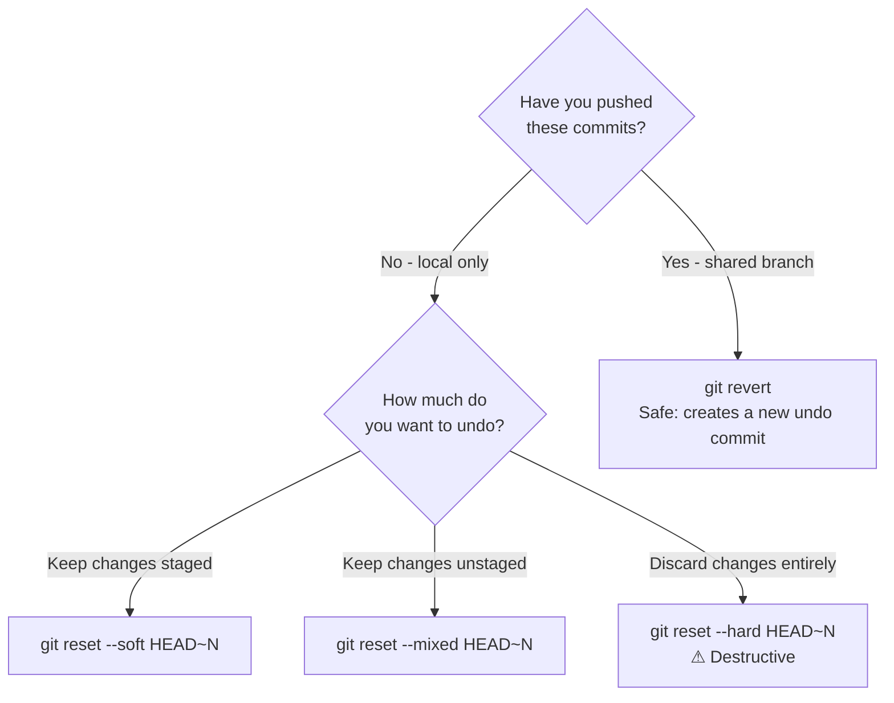

# Chapter 14: Reverting Commits and Tags

## Undoing Changes

Git provides several ways to undo work. The right choice depends on whether the commits are public (pushed to a shared branch) or private (local only).



### git revert — Safe Undo

**[Revert](./glossary.md#revert)** creates a **new** commit that applies the inverse of a previous commit. It does not rewrite history, making it safe to use on branches shared with others.

```bash
# Undo a specific commit by hash
git revert abc1234

# Revert without immediately committing (review first)
git revert --no-commit abc1234

# Revert a merge commit (specify which parent to keep)
git revert -m 1 abc1234
```

### git reset — Rewrite Local History

`git reset` moves the branch pointer backward. Use only on commits that have not been pushed.

```bash
# Move pointer back, keep changes staged
git reset --soft HEAD~1

# Move pointer back, keep changes in working directory (default)
git reset --mixed HEAD~1

# Move pointer back, discard all changes — permanent data loss
git reset --hard HEAD~1
```

### Discarding File Changes

```bash
# Discard changes to a file in the working directory
git restore README.md

# Unstage a file (remove from staging area, keep changes)
git restore --staged README.md
```

## Tags

A **[tag](./glossary.md#tag)** is a permanent, named label pointing to a specific commit. Tags are typically used to mark release versions. Unlike branches, tags do not move when new commits are made.

### Lightweight vs. Annotated Tags

| | Lightweight | Annotated |
|---|---|---|
| Stores | Only the commit hash | Hash + tagger, date, message |
| GPG signing | No | Yes (with `-s`) |
| Recommended | For local/temp marks | For public releases |

```bash
# Create an annotated tag (preferred for releases)
git tag -a v1.2.0 -m "Release version 1.2.0"

# Create a lightweight tag
git tag v1.2.0

# Tag a past commit
git tag -a v1.0.0 abc1234 -m "Initial release"

# List all tags
git tag

# List tags matching a pattern
git tag -l "v1.*"

# Show tag details
git show v1.2.0

# Tags are NOT pushed automatically
git push origin v1.2.0
git push origin --tags
```

---

→ **Next:** [Chapter 15: Pull Requests](./15-pull-requests.md)
← **Prev:** [Chapter 13: Stashing](./13-stashing.md)
