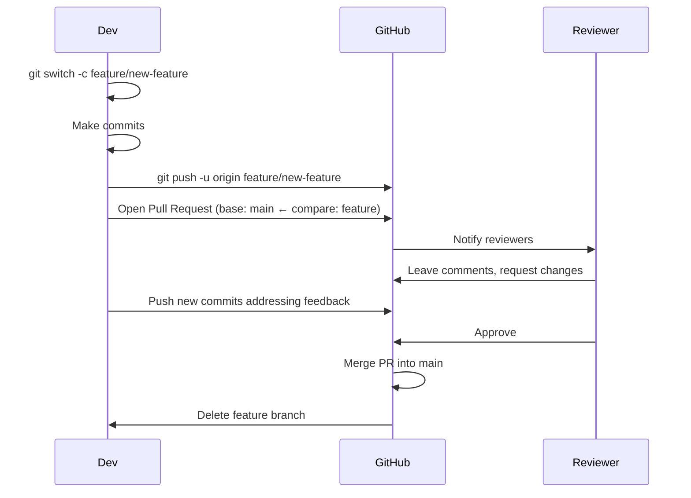

# Chapter 15: Pull Requests

A **[pull request (PR)](./glossary.md#pull-request-pr)** is a GitHub feature that lets you propose merging changes from one branch into another, with a structured code review interface. PRs are the primary collaboration mechanism on GitHub.

## The Pull Request Workflow



## Opening a Pull Request

1. Push your branch to GitHub
2. GitHub shows a **"Compare & pull request"** banner — click it
3. Set the **base branch** (where changes go, usually `main`) and **compare branch** (your feature)
4. Write a clear title and description
5. Assign reviewers, labels, and link related issues
6. Click **Create pull request**

## Writing a Good PR Description

A strong PR description answers:

- **What** does this change do?
- **Why** is it needed? (link the issue: `Closes #42`)
- **How** should a reviewer test or verify it?
- **Screenshots** for any UI changes

```markdown
## Summary
Adds server-side validation for the registration form.

## Changes
- Validate email format and uniqueness on the backend
- Return structured error messages to the frontend
- Add unit tests for all validation rules

## Testing
1. Run `npm test` — all tests should pass
2. Try submitting the form with a duplicate email

Closes #87
```

## PR Review Best Practices

**As an author:**
- Review your own diff before requesting review
- Keep PRs small and focused — aim for under 400 lines changed
- Respond to all comments, even if just acknowledging

**As a reviewer:**
- Distinguish blocking issues from suggestions (`nit:` prefix for minor style comments)
- Ask questions rather than making demands
- Approve explicitly when satisfied

## Merge Strategies on GitHub

GitHub offers three merge strategies per PR:

| Strategy | Creates merge commit? | Rewrites history? |
|---|---|---|
| Merge commit | Yes | No |
| Squash and merge | No (one new commit) | Yes |
| Rebase and merge | No | Yes |

Most teams standardize on one strategy. **Squash and merge** keeps `main` history clean; **merge commit** preserves full branch context.

---

→ **Next:** [Chapter 16: How Git Works Under the Hood](./16-under-the-hood.md)
← **Prev:** [Chapter 14: Reverting Commits and Tags](./14-reverting-commits-and-tags.md)
