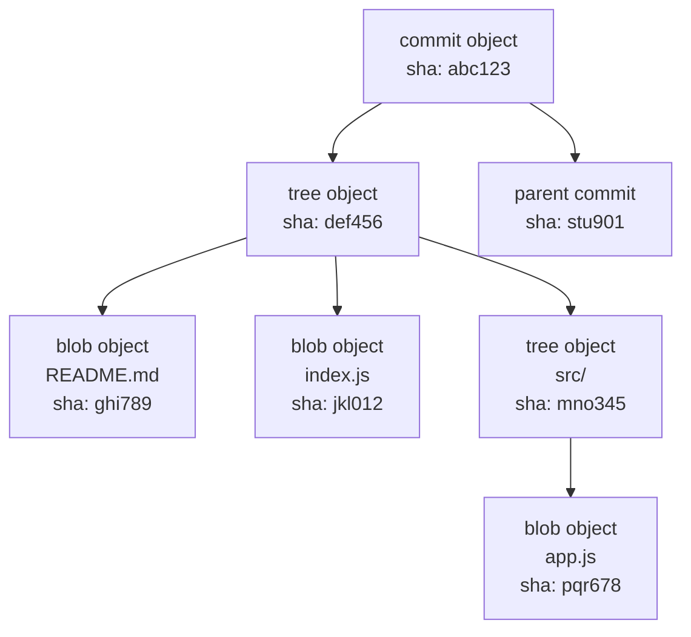
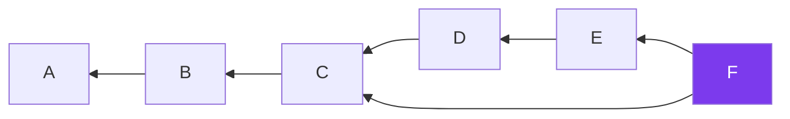

# Chapter 16: How Git Works Under the Hood

Git is, at its core, a **content-addressable filesystem** layered with a version control interface. Understanding the object model makes every Git command make more sense.

## The Four Object Types

Everything Git stores is one of four object types, each identified by a **[SHA-1](./glossary.md#sha-1)** hash:



### Blob

A **[blob](./glossary.md#blob)** stores raw file content — nothing else. No filename, no path. Two identical files across your entire history share one blob.

### Tree

A **[tree object](./glossary.md#tree-object)** maps filenames and directory paths to blob hashes. A tree represents one directory at one moment in time.

### Commit

A **[commit object](./glossary.md#commit-object)** contains:
- A pointer to the root **tree** (snapshot of the entire project)
- Zero or more **parent** commit hashes
- **Author** and **committer** (name, email, timestamp)
- The **commit message**

### Tag

An annotated tag object stores the tagger identity, message, and a pointer to the tagged commit.

## The .git Directory

```
.git/
├── HEAD          ← points to current branch ref
├── config        ← repo-level git config
├── index         ← the staging area
├── objects/      ← all blobs, trees, commits, tags
│   ├── ab/
│   │   └── cdef1234...  ← object file (first 2 chars = subdirectory)
│   ├── pack/     ← packed objects (compressed)
└── refs/
    ├── heads/    ← local branches
    │   └── main
    └── remotes/  ← remote-tracking branches
        └── origin/
            └── main
```

## How a Branch is Just a File

A branch is literally a text file in `.git/refs/heads/` containing one SHA-1 hash.

```bash
cat .git/refs/heads/main
# a1b2c3d4e5f6789...

cat .git/HEAD
# ref: refs/heads/main
```

When you commit, Git writes the new commit hash to this file. That's the entirety of "advancing a branch."

## Inspecting Objects Directly

```bash
# What type is this object?
git cat-file -t HEAD
# commit

# Pretty-print the commit
git cat-file -p HEAD
# tree 4b825dc...
# parent a1b2c3d...
# author Kevin <k@example.com> 1700000000 +0000
# feat: add login page

# Pretty-print the tree
git cat-file -p 4b825dc
# 100644 blob abc123  README.md
# 040000 tree def456  src
```

## The DAG

Git history is a **[DAG (Directed Acyclic Graph)](./glossary.md#dag-directed-acyclic-graph)**. Each commit points to its parent(s). Merge commits have two parents. The graph can only flow in one direction — you can never create a cycle.



F is a merge commit with parents E and C. This is the structure Git navigates when computing `git log`, `git diff`, and `git merge`.

---

→ **Next:** [Chapter 17: More Stuff GitHub Gives You](./17-github-features.md)
← **Prev:** [Chapter 15: Pull Requests](./15-pull-requests.md)
