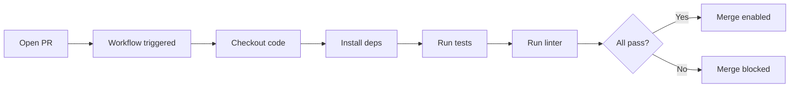

# Chapter 17: More Stuff GitHub Gives You

Beyond hosting repositories, GitHub provides a suite of tools that cover the entire software development lifecycle.

## Issues

Issues are GitHub's built-in task tracker. Use them to report bugs, request features, and track work.

- **Labels** — Categorize issues: `bug`, `enhancement`, `good first issue`
- **Milestones** — Group issues into releases or sprints
- **Assignees** — Assign ownership
- **Closing keywords** — `Closes #42` in a PR description auto-closes the issue on merge

## GitHub Actions

GitHub Actions is a CI/CD platform built directly into GitHub. Define workflows as YAML files in `.github/workflows/`.

```yaml
# .github/workflows/test.yml
name: Run Tests

on:
  push:
    branches: [main]
  pull_request:

jobs:
  test:
    runs-on: ubuntu-latest
    steps:
      - uses: actions/checkout@v4
      - uses: actions/setup-node@v4
        with:
          node-version: 20
      - run: npm ci
      - run: npm test
```



Common uses: running tests on every PR, deploying on push to `main`, publishing packages on new tags.

## GitHub Pages

Host a static website directly from a repository. Enable it in Settings → Pages. Point it at a branch (commonly `gh-pages` or a `/docs` folder on `main`). Your site is available at `username.github.io/repo-name`.

## Code Review Features

- **Required reviewers** — Protect a branch by requiring N approvals before merge
- **Draft PRs** — Open a PR marked as work-in-progress; reviewers won't be notified until you mark it ready
- **Suggested changes** — Reviewers can propose exact code changes that the author can apply with one click
- **CODEOWNERS** — A `.github/CODEOWNERS` file automatically requests reviews from the right people based on which files changed

## Branch Protection Rules

Protect important branches from accidental or unreviewed changes:

Settings → Branches → Add rule

Common protections:
- Require PR before merging
- Require status checks to pass (e.g., CI must be green)
- Require review from code owners
- Disallow force pushes
- Require signed commits

---

→ **Next:** [Chapter 18: Git Workflows](./18-git-workflows.md)
← **Prev:** [Chapter 16: How Git Works Under the Hood](./16-under-the-hood.md)
