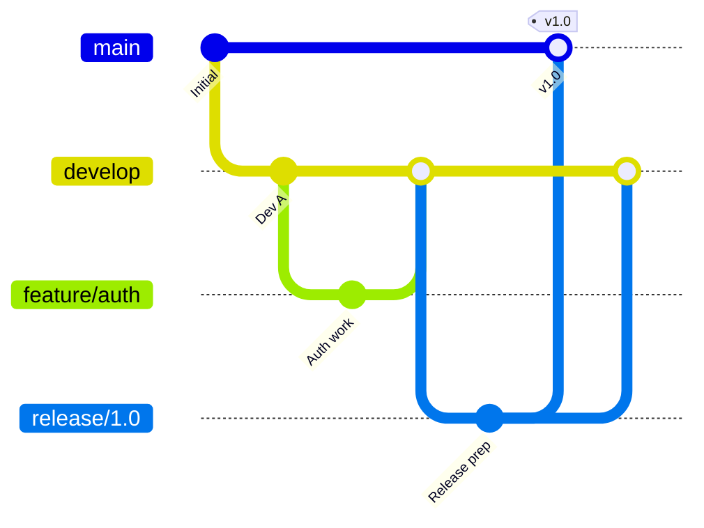
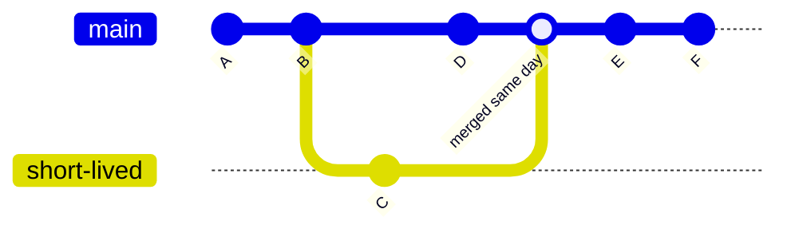

# Chapter 18: Git Workflows

A workflow is a convention for how your team uses branches. Choosing one and using it consistently prevents confusion and merge chaos.

## GitHub Flow

The simplest workflow. `main` is always deployable. All work happens on short-lived feature branches merged via pull requests.

```mermaid
gitGraph
   commit id: "A"
   commit id: "B"
   branch feature-login
   commit id: "C"
   commit id: "D"
   checkout main
   merge feature-login id: "PR merged"
   commit id: "E"
   branch feature-dashboard
   commit id: "F"
   commit id: "G"
   checkout main
   merge feature-dashboard id: "PR merged"
```

**Rules:**
1. Anything on `main` is deployable
2. Create a branch for every change
3. Open a PR early for discussion
4. Merge only after review and CI passes
5. Deploy immediately after merging

**Best for:** Teams with continuous deployment, web apps, small-to-medium teams.

## Git Flow

A more structured workflow with multiple long-lived branches and strict rules about what merges where.



**Branches:**

| Branch | Purpose | Merges into |
|--------|---------|-------------|
| `main` | Production releases only | — |
| `develop` | Integration branch | `main` via release |
| `feature/*` | New features | `develop` |
| `release/*` | Release preparation | `main` + `develop` |
| `hotfix/*` | Emergency production fixes | `main` + `develop` |

**Best for:** Software with versioned, scheduled releases (libraries, desktop apps, mobile apps).

## Trunk-Based Development

**[Trunk-based development](./glossary.md#trunk-based-development)** has all developers commit small changes directly to `main` (the trunk) multiple times per day. Feature branches exist for no more than a day or two.



Requires: strong CI/CD, automated testing, and **feature flags** to hide incomplete work in production.

**Best for:** High-performing teams with mature CI/CD pipelines.

## Forking Workflow

Used primarily in open source. Contributors do not have write access to the main repository. Instead, each contributor **[forks](./glossary.md#fork)** the repo, works in their fork, and submits PRs back to the original (called `upstream`).

```bash
# Clone your fork
git clone git@github.com:yourname/project.git

# Add the original repo as 'upstream'
git remote add upstream git@github.com:original/project.git

# Sync your fork with upstream
git fetch upstream
git merge upstream/main
```

## Choosing a Workflow

| Factor | Recommended Workflow |
|--------|---------------------|
| Continuous deployment, web app | GitHub Flow |
| Versioned software with release cycles | Git Flow |
| Large team, mature CI/CD | Trunk-Based |
| Open source project | Forking Workflow |

---

→ **Next:** [Chapter 19: Reflog + Bisect + Cherry Pick](./19-reflog-bisect-cherry-pick.md)
← **Prev:** [Chapter 17: More Stuff GitHub Gives You](./17-github-features.md)
