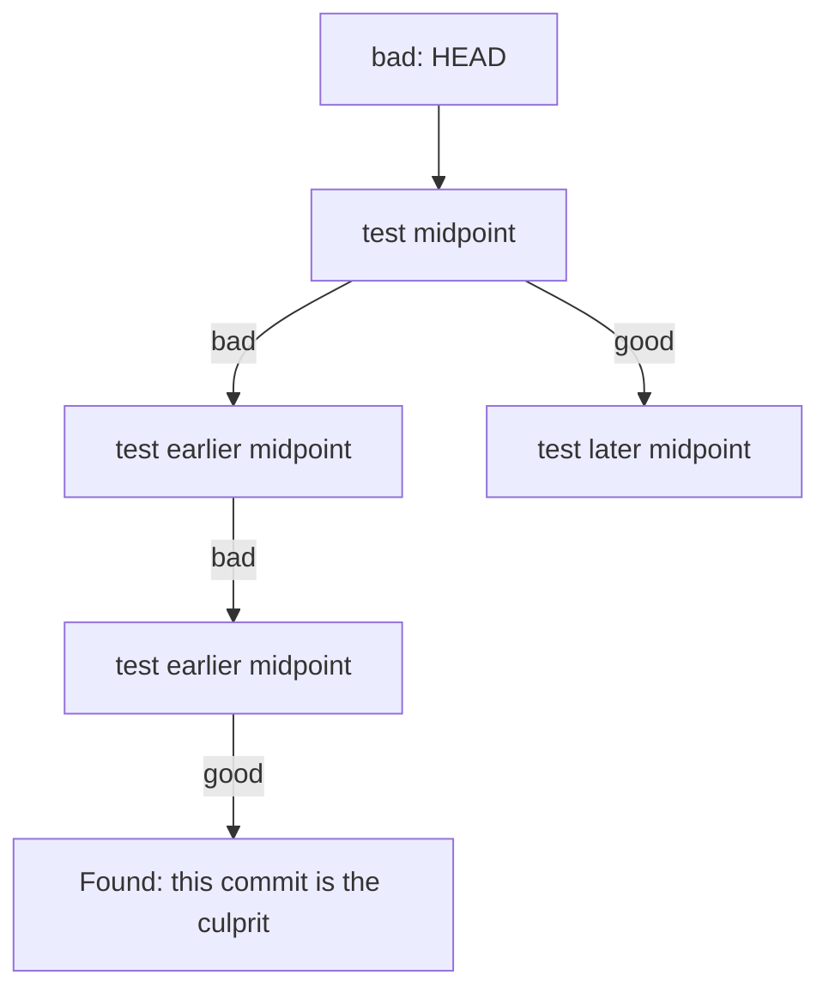
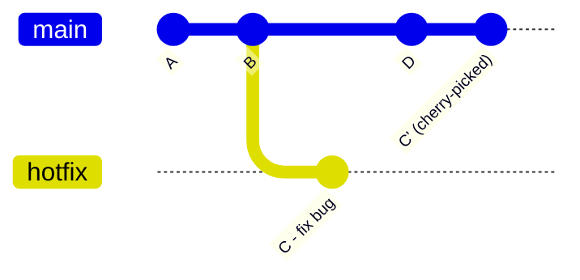

# Chapter 19: Reflog + Bisect + Cherry Pick

Three power-user commands that solve problems you cannot solve with the basics.

## git reflog — Your Safety Net

**[Reflog](./glossary.md#reflog)** records every movement of [HEAD](./glossary.md#head) on your local machine. Even after a `--hard` reset, a deleted branch, or a botched rebase, your commits are not truly gone until Git's garbage collector runs (typically 30–90 days).

```bash
git reflog
# a1b2c3d HEAD@{0}: reset: moving to HEAD~2
# d4e5f6g HEAD@{1}: commit: feat: add dashboard
# c7d8e9f HEAD@{2}: commit: feat: add sidebar
# b0c1d2e HEAD@{3}: checkout: moving from main to feature
```

Each entry shows what HEAD was pointing to and what operation moved it.

### Recovering Lost Commits

```bash
# Find the hash of the commit you want back
git reflog

# Restore to that commit (creates a detached HEAD)
git checkout d4e5f6g

# Or, create a new branch at that point
git switch -c recovered-work d4e5f6g

# Or, reset your current branch back to it
git reset --hard d4e5f6g
```

> **Note:** Reflog is local. It is not pushed to the remote. You cannot recover a teammate's lost work using your reflog.

## git bisect — Find the Broken Commit

**Bisect** performs a binary search through commit history to find the exact commit that introduced a bug. You tell Git which commit is "good" and which is "bad," and it checks out the midpoint. You test, report the result, and Git halves the search space again.



```bash
# Start bisect
git bisect start

# Mark current commit as bad (has the bug)
git bisect bad

# Mark a known-good commit (e.g., a tag or hash)
git bisect good v1.2.0

# Git checks out the midpoint commit
# Test your application, then report:
git bisect good   # or: git bisect bad

# Repeat until Git identifies the culprit:
# "abc1234 is the first bad commit"

# Return to normal
git bisect reset
```

### Automated Bisect

If you have a script that exits 0 for good and non-zero for bad:

```bash
git bisect start HEAD v1.2.0
git bisect run npm test
```

Git will find the culprit automatically without any manual testing.

## git cherry-pick — Apply Specific Commits

**[Cherry-pick](./glossary.md#cherry-pick)** applies the changes introduced by one or more commits onto your current branch. The original commits remain untouched; cherry-pick creates new commits with the same changes but new [SHA-1](./glossary.md#sha-1) hashes.



```bash
# Apply a single commit
git cherry-pick abc1234

# Apply a range of commits (inclusive)
git cherry-pick abc1234^..def5678

# Stage the changes without committing (review first)
git cherry-pick -n abc1234

# If a conflict occurs
git cherry-pick --continue   # after resolving
git cherry-pick --abort      # cancel entirely
```

**Common use case:** A bug is fixed on a feature branch. You need the fix on `main` right now, but the full feature isn't ready to merge. Cherry-pick brings just the fix.

---

→ **Next:** [Chapter 20: Good and Bad Practices](./20-good-and-bad-practices.md)
← **Prev:** [Chapter 18: Git Workflows](./18-git-workflows.md)
