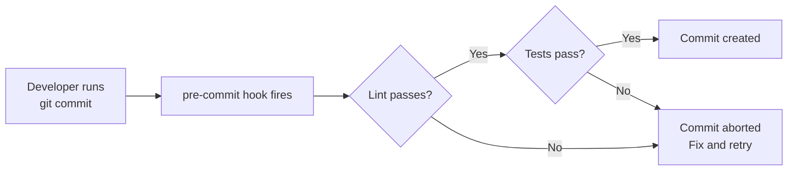

# Chapter 21: Hooks and Webhooks

## Git Hooks

A **[hook](./glossary.md#hook)** is an executable script Git runs automatically at specific points in its workflow. Hooks live in `.git/hooks/` and are not committed to the repository (so they don't automatically apply to all contributors without extra tooling).

### Client-Side Hooks

These run on your local machine.

| Hook | When it runs | Common uses |
|------|-------------|-------------|
| `pre-commit` | Before a commit is created | Lint, format, run fast tests |
| `commit-msg` | After you write the commit message | Enforce message format |
| `prepare-commit-msg` | Before the message editor opens | Auto-populate templates |
| `pre-push` | Before pushing to a remote | Run full test suite |

### Server-Side Hooks

These run on the remote (e.g., a self-hosted Git server).

| Hook | When it runs | Common uses |
|------|-------------|-------------|
| `pre-receive` | Before accepting a push | Enforce branch protection policies |
| `post-receive` | After a push is accepted | Trigger deployments, notifications |

### Creating a Hook

```bash
# Example: pre-commit hook that runs the linter
cat > .git/hooks/pre-commit << 'EOF'
#!/bin/sh
npm run lint
if [ $? -ne 0 ]; then
  echo "Linting failed. Fix errors before committing."
  exit 1
fi
EOF

chmod +x .git/hooks/pre-commit
```

Returning a non-zero exit code from any hook aborts the Git operation.

### Sharing Hooks with Your Team: Husky

Because `.git/hooks/` is not tracked by Git, hooks don't automatically apply to all contributors. **Husky** is an npm package that stores hooks in your repository and installs them automatically when contributors run `npm install`.

```bash
npm install --save-dev husky
npx husky init
```

This creates a `.husky/` directory that is committed to the repo.

```bash
# .husky/pre-commit
npm run lint && npm run test:unit
```



## GitHub Webhooks

A **[webhook](./glossary.md#webhook)** is an HTTP POST request GitHub sends to a URL you configure whenever a repository event occurs — a push, a PR being opened, an issue being created, and so on.

### Configuring a Webhook

Repository Settings → Webhooks → Add webhook

- **Payload URL** — Your server endpoint (e.g., `https://myapp.com/github-webhook`)
- **Content type** — Use `application/json`
- **Secret** — A shared secret to verify the payload is genuinely from GitHub
- **Events** — Choose specific events or "Send me everything"

### Verifying Webhook Payloads

GitHub signs each payload with your secret using HMAC-SHA256. Always verify this signature before processing.

```javascript
const crypto = require('crypto');

function verifySignature(payload, signature, secret) {
  const expected = 'sha256=' + crypto
    .createHmac('sha256', secret)
    .update(payload)
    .digest('hex');
  return crypto.timingSafeEqual(
    Buffer.from(signature),
    Buffer.from(expected)
  );
}
```

**Common webhook uses:** Triggering deployments on push to `main`, posting Slack notifications on new PRs, syncing issues to an external project management tool.

---

→ **Next:** [Chapter 22: Submodules, Subtrees, and Monorepos](./22-submodules-subtrees-monorepos.md)
← **Prev:** [Chapter 20: Good and Bad Practices](./20-good-and-bad-practices.md)
