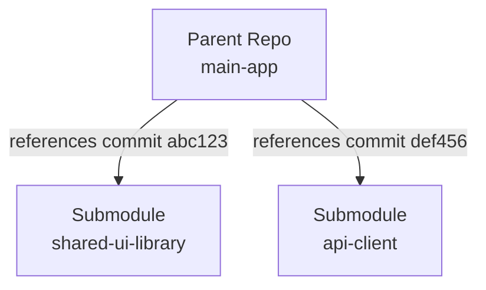
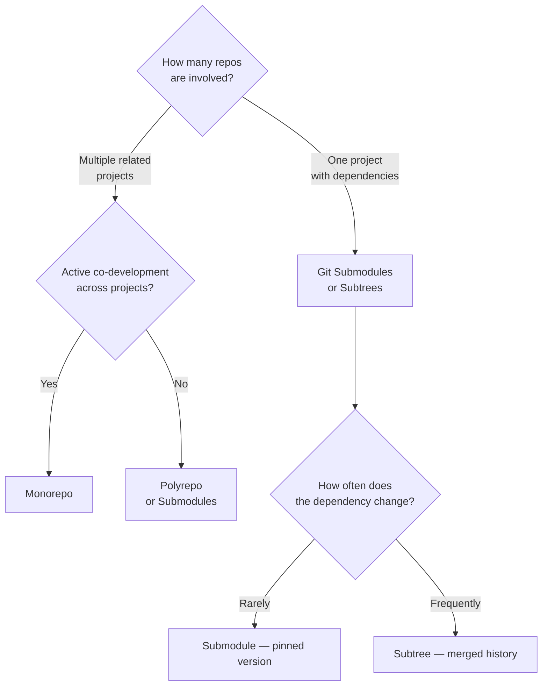

# Chapter 22: Submodules, Subtrees, and Monorepos

When a project depends on other repositories — or when you want to manage multiple projects together — Git provides several strategies.

## Git Submodules

A **[submodule](./glossary.md#submodule)** embeds one Git repository inside another as a reference to a specific commit. The parent repository stores the submodule's URL and the exact commit hash it should be pinned to.



```bash
# Add a submodule
git submodule add git@github.com:org/shared-ui.git libs/shared-ui

# This creates .gitmodules and a new entry in the index
cat .gitmodules
# [submodule "libs/shared-ui"]
#   path = libs/shared-ui
#   url = git@github.com:org/shared-ui.git

# Clone a repo that has submodules
git clone --recurse-submodules git@github.com:org/main-app.git

# If you cloned without --recurse-submodules
git submodule update --init --recursive

# Update all submodules to their latest remote commit
git submodule update --remote --merge
```

**Submodule tradeoffs:**

| Pro | Con |
|-----|-----|
| Pinned to exact commit — predictable | Steeper learning curve for contributors |
| Clear separation between repos | Easy to forget to update or push submodule changes |
| Independent version histories | Clone and CI setup requires extra steps |

## Git Subtrees

`git subtree` merges another repository's history into a subdirectory of your repository. Contributors do not need any special commands — the subtree is just a folder.

```bash
# Add a subtree
git subtree add --prefix=libs/shared-ui \
  git@github.com:org/shared-ui.git main --squash

# Pull updates from the subtree remote
git subtree pull --prefix=libs/shared-ui \
  git@github.com:org/shared-ui.git main --squash

# Push changes back to the subtree remote
git subtree push --prefix=libs/shared-ui \
  git@github.com:org/shared-ui.git main
```

**Subtrees vs. submodules:**

| | Submodule | Subtree |
|---|---|---|
| Complexity for contributors | High | Low |
| History | Separate | Merged in |
| Sync workflow | Explicit update step | `git subtree pull` |
| Best for | Pinned, infrequently changed deps | Actively co-developed shared code |

## Monorepos

A **[monorepo](./glossary.md#monorepo)** is a single Git repository containing multiple related projects — a frontend, a backend, shared libraries, and tooling — all in one place.

```
monorepo/
├── apps/
│   ├── web/          ← React frontend
│   └── api/          ← Node.js backend
├── packages/
│   ├── ui/           ← Shared component library
│   └── utils/        ← Shared utilities
└── package.json      ← Workspace root
```

### Monorepo Benefits

- Atomic cross-project changes in a single commit/PR
- Shared tooling, linting, and CI config
- Easier code sharing and refactoring across projects

### Monorepo Challenges

- Repository size grows large over time
- CI/CD must be smart enough to only rebuild affected packages
- `git log` and `git blame` become harder to navigate without filtering by path

### Monorepo Tooling

| Tool | Language | Key feature |
|------|---------|-------------|
| Turborepo | JavaScript/TypeScript | Incremental builds, remote caching |
| Nx | JavaScript/TypeScript | Dependency graph, code generators |
| Bazel | Polyglot | Hermetic builds at Google/Meta scale |
| Lerna | JavaScript/TypeScript | Package publishing, version management |

```bash
# Work with a specific package in a JS monorepo
git log -- apps/web/    # history for the web app only
git diff HEAD~1 -- packages/ui/  # diff for the ui package
```

## Choosing an Approach



---

← **Prev:** [Chapter 21: Hooks and Webhooks](./21-hooks-and-webhooks.md)

---

## Course Complete

You have covered the full Git Masterclass curriculum. For quick lookups, see the [Glossary](./glossary.md).
